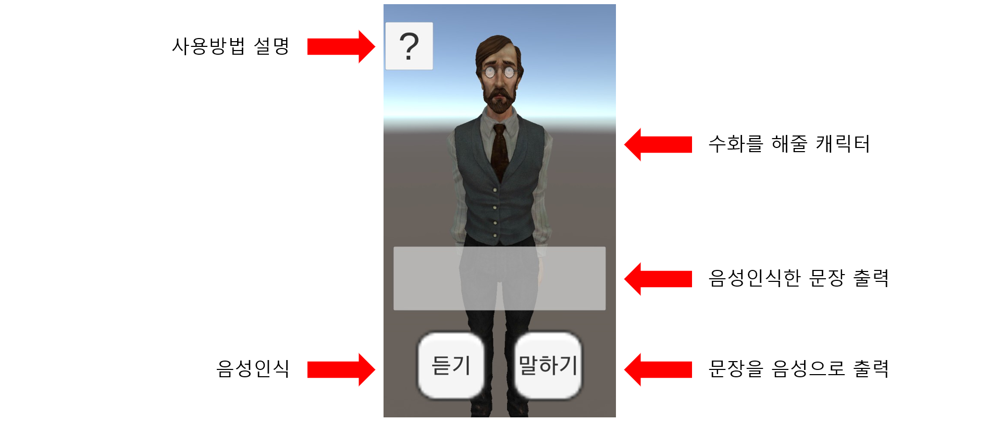
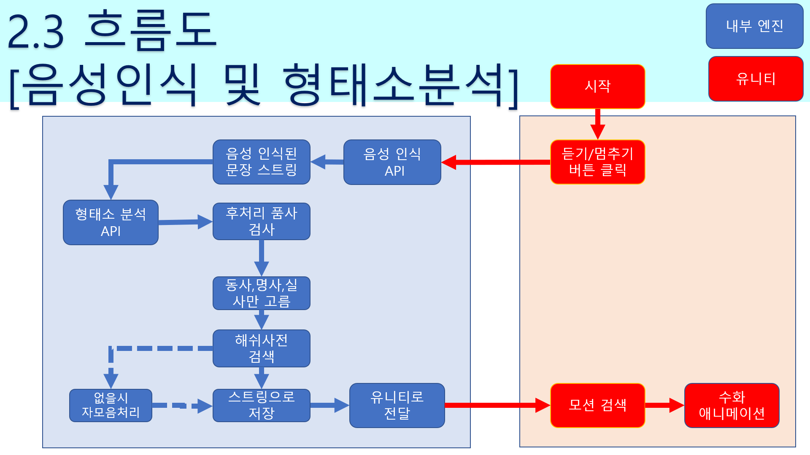

# NSB
2018년 경기대학교 캡스톤 프로젝트 "너의 목소리가 보여"

## 개요

 기존의 프로그램들은 수화를 음성언어로 바꿔주는 것은 있었는데, 막상 보통의 언어를 수화로 바꿔주는 것은 찾지 못했습니다.

 바꿔 주더라도 음성이 아닌 문장 단위로 바꿔주기 때문에 일반인이 이용하기엔 꽤 불편함이 있습니다.

 *그러므로 청각장애인과 대화를 원활하게 하기 위해서 혹은 수화를 공부하고 싶어하는 사람들을 위해서 음성을 수화로 통역해 주는 앱을 만들었습니다.*

## 수화 언어란?

수화언어는 **제한된 시간 내**에 **한정된 표현**을 통해 원하는 의미만을 전달해야 하므로, 허사(虛辭; 문법적 기능을 나타내는 조사, 어미 등)를 최대한 생략하고 **실사(實辭) 위주**로 발달했다. 

## 팀원 및 역활

- 팀 대표 : 이찬우
  - 역활 : PM, 개발(안드로이드 설계)
- 팀 원 : 강민규
  - 역활 : 개발(안드로이드 설계)
- 팀 원 : 고영훈
  - 역활 : 개발(유니티 애니메이션 설계)
- 팀 원 : 김광연
  - 역활 : 개발(안드로이드 설계)

## 사용 기술

- Java
- [Unity Engine](https://unity.com/kr)
- [MMD](https://sites.google.com/view/vpvp//)
- [Text to Speech API](https://cloud.google.com/)
- [Speech to Text API](https://cloud.google.com/)
- [형태소분석기 API](http://aiopen.etri.re.kr/)

## UI

## 흐름도

## 실행 영상

[너의 목소리가 보여 실행 영상](https://youtu.be/IV5g_Y7k_tA)