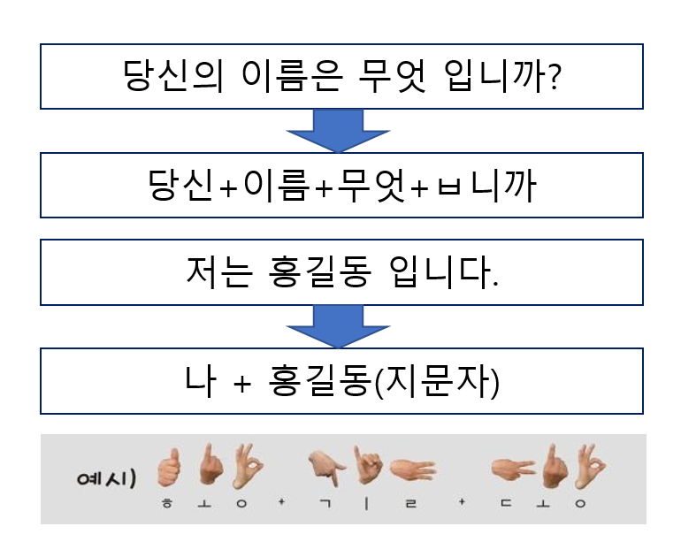

# NSB
2018년 경기대학교 캡스톤 프로젝트 "너의 목소리가 보여"

## 개요

## 수화 언어란?

수화언어는 **제한된 시간 내**에 **한정된 표현**을 통해 원하는 의미만을 전달해야 하므로, 허사(虛辭; 문법적 기능을 나타내는 조사, 어미 등)를 최대한 생략하고 **실사(實辭) 위주**로 발달했다. 

## 팀원 및 역활

- 팀 대표 : 이찬우
  - 역활 : PM, 개발(안드로이드 설계)
- 팀 원 : 강민규
  - 역활 : 개발(안드로이드 설계)
- 팀 원 : 고영훈
  - 역활 : 개발(유니티 애니메이션 설계)
- 팀 원 : 김광연
  - 역활 : 개발(안드로이드 설계)

## 사용 기술

- Java
- Unity Engine
- MMD
- Text to Speech API
- Speech to Text API
- 형태소분석기 API

