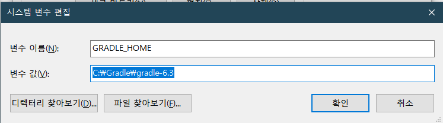
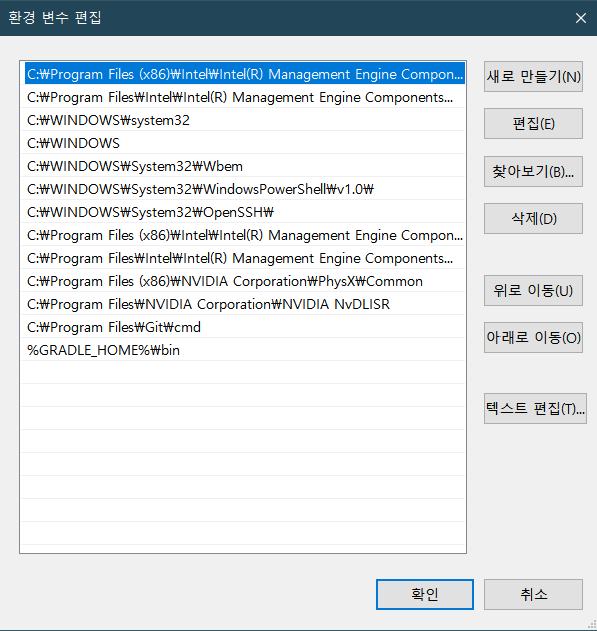

##### gradle project sync failed. basic functionality

1. 최신 버전의 gradle을 https://gradle.org/install 에서 다운받습니다.

2.  Windows

   - 받으신 파일을 압축 해제 합니다.

   - C:/Gradle 폴더를 생성해줍니다.

   - 압축 해제한 폴더를 방금 생성한 C:/Gradle 폴더 안에 넣습니다. (ex - C:\Gradle\gradle-4.8.1)

3. Windows

   - '내 PC''의 속성에 들어가서 '고급 시스템 설정' - '환경 변수'를 클릭합니다.

   - '시스템 변수'의 Path 항목을 선택하고 '편집'을 눌러 bin 폴더의 절대경로를 추가해줍니다. (ex- C:\gradle\gradle-4.8.1\bin)

   - 확인 버튼을 누릅니다.

4. 콘솔 창(명령 프롬프트)을 열어서 "gradle -v" 명령 입력을 통해 gradle이 잘 설치되었는지 확인합니다.

   1. 만약 'gradle'은(는) 내부 또는 외부 명령, 실행할 수 있는 프로그램, 또는
      배치 파일이 아닙니다. 라는 에러가 뜨면 환경 변수 설정

      - "시스템 변수"에 변수 값을`GRADLE_HOME`, 변수 값을 gradle 설치 위치

        

      - "시스템 변수"에 Path 변수에 `%GRADLE_HOME%\bin`를 넣어준다.

        

###### 참고

https://readystory.tistory.com/9

##### Gradle project sync failed. Basic functionality (e.g. editing, debugging) will not work properly

빌드 도구 버전이 프로젝트에 설정 되지 않은 경우 문제가 발생한다.

프로젝트 구조[ [[File->Project Structure\]](https://i.stack.imgur.com/71Mwf.png) ]를 열고 Modules 섹션의 앱 속성탭에서 **Build Tools Version**를 선택한다.